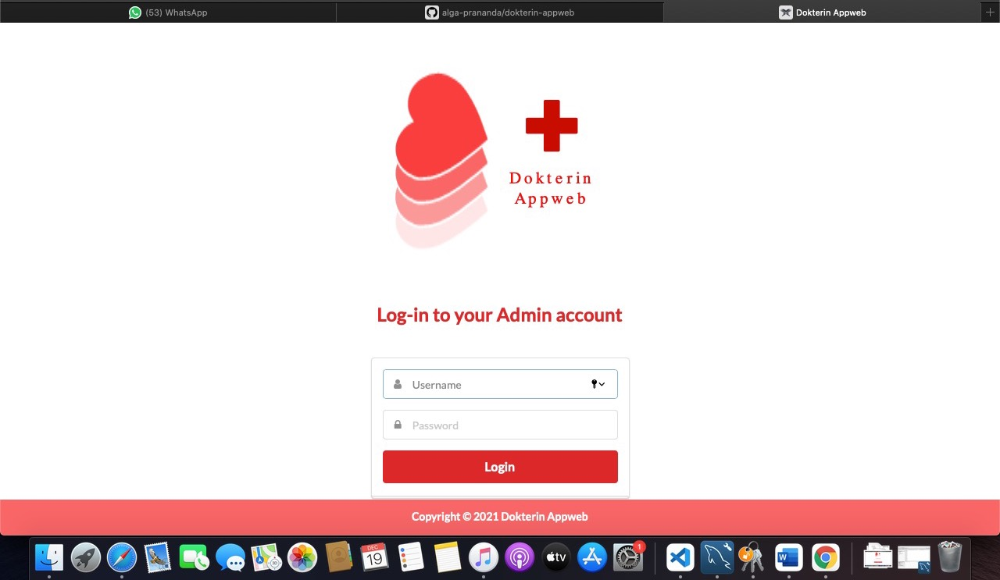

# Dokterin Appweb &middot; 

Konsultasi antara pasien dengan Dokter

### Overview

Dokterin singkatan dari Dokter Internet merupakan sistem manajemen pasien berbasis web yang memberikan dokter dan pasien akses mudah ke rekam medis dan memungkinkan pasien dan dokter untuk berkomunikasi melalui fitur obrolan.

### Pictures

;

# Packages Used

* [Node.JS](https://www.npmjs.com/)
* [MySQL](https://www.npmjs.com/package/mysql)
* [Express](https://www.npmjs.com/package/express)
* [Sequelize](http://docs.sequelizejs.com/)
* [Sequelize-fixtures](https://www.npmjs.com/package/sequelize-fixtures)
* [Socket.io](https://www.npmjs.com/package/socket.io)
* [Passport](https://www.npmjs.com/package/passport)
* [bcrypt-nodejs](https://www.npmjs.com/package/bcrypt-nodejs)
* [Chart.js](https://www.npmjs.com/package/chart.js)
* [Handlebars](https://www.npmjs.com/package/express-handlebars)
* [Helper-Moment](https://www.npmjs.com/package/helper-moment)
* [Heroku](https://www.npmjs.com/package/heroku)
